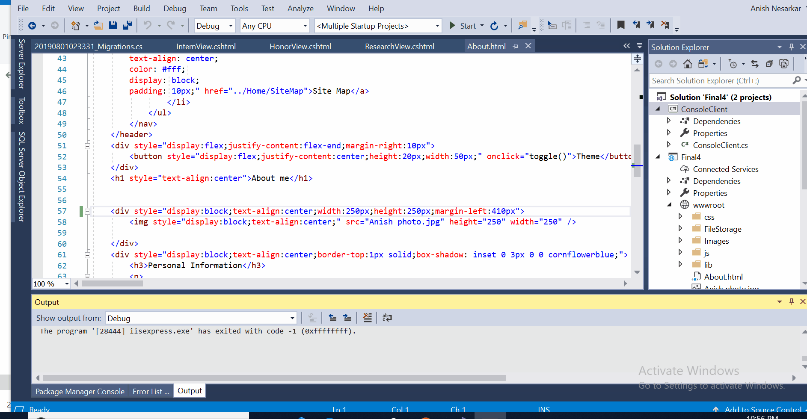

# About
This project is a Personal Website intended to display my Educational history, Professional experience, Career preference, Statement of Interest, Portfolio projects etc. The site also provides the ability to accept comments and requests from the recruiters that are authenticated by the site.
The private inputs like comments are viewable and editable only by the admin and the authenticated user. 

The site is built on **ASP .NET Core MVC** framework, **SQL Server** as database and **Entity Framework** to manage the database. The site provides a webservice for the clients built using ASP .NET Web API with the ability to upload, edit and delete projects, resumes etc.

## How to run the project
* Clone the repository in your local machine
* *Run as administrator* the solution file **Final4.sln** using *Visual Studio*
* Rebuild the database and entity framework as follows:
  * Right Click on the Console client in the solution explorer and Unload the project.
  * Delete the Migrations folder
  * Delete the database created in the SQL server. ( *No need to this when running the project for first time* )
  * Open package manager console. In powershell, type the command `add-migration Migrations' ( * This will create **Migrations** folder )
  * Type the command `update-database`. This will create a fresh database.
  * Right click the ConsoleClient project and Reload the project.
* Right Click **Solution** -> Set StartUp projects -> Multiple startup projects. Set ***ConsoleClient*** and ***Final4*** Action to start.
* Start the project in Debugging mode.

### File upload from Client to Server
The Console Client uploads required files from client to the Server using the Web API. See below

